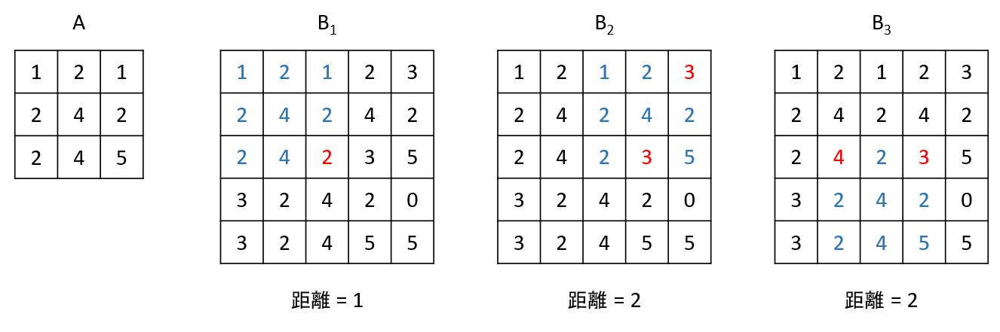

# Task Description
矩陣是將一群元素整齊的排列成一個矩形，在矩陣中的橫排稱為列 (row)，直排稱為行 (column)，一個$n \\times m$的矩陣有 $n$ 列 $m$ 行，其中以 $X\_{ij}$ 來表示矩陣 $X$ 中的第 $i$ 列第 $j$ 行的元素。在同樣大小的矩陣中，我們定義兩個矩陣的距離為兩矩陣中對應位置相同但值不相同的元素數量。

有一個 $s \\times t$ 的小矩陣 $A$，和一個 $n \\times m$ 的大矩陣 $B$，請計算 $B$ 矩陣的子矩陣中，與 $A$ 矩陣距離不超過 $r$ 的子矩陣個數，並從這些距離 $A$ 不超過 $r$ 的子矩陣中，找到總和與 $A$ 差異最小的值。

以範例二為例，$B$ 矩陣中有3個子矩陣與 $A$ 距離不超過 $2$，其中 $A$ 的元素總和為 $1+2+1+2+4+2+2+4+5=23$，$B\_1$ 的元素總和為$20$，$B\_2$ 的元素總和為 $24$ ，$B\_3$ 的元素總和為 $28$。與 $A$ 元素總和最小值的為 $|23-24| = 1$。


# Input Format
第一行有五個正整數$s$，$t$，$n$，$m$ 與 $r$。

接下來 $s$ 行(line)每行包含 $t$ 個數，第 $i$ 行第 $j$ 個數代表 $A\_{ij}$ 的值。

接下來 $n$ 行(line)每行包含 $m$ 個數，第 $i$ 行第 $j$ 個數代表 $B\_{ij}$ 的值。

同一行間數字以空格隔開。

測資範圍如下：

* $1 \\leq s \\leq n \\leq 10$
* $1 \\leq t \\leq m \\leq 100$
* $1 \\leq r \\leq 100$
* $0 \\leq A\_{ij},B\_{ij}≤9$

 本題包含三個子題組，每個子題組配分如下：

* 第 1 子題組共 50 分： $s = n = 1$
* 第 2 子題組共 50 分： 無額外限制。
# Output Format
輸出有兩行：

第一行輸出符合條件的子矩陣個數。

第二行輸出所有符合條件的子矩陣中，數字總和與$A$相差最小的值，若找不到符合條件的子矩陣，則輸出$-1$。
# Hint

# Sample Input 1
```
1 3 1 10 1
7 4 7
6 7 7 7 4 5 0 4 4 7
```
# Sample Output 1
```
3
2

                     ```
# Sample Input 2
```
3 3 5 5 2
1 2 1
2 4 2
2 4 5
1 2 1 2 3
2 4 2 4 2
2 4 2 3 5
3 2 4 2 0
3 2 4 5 5
```
# Sample Output 2
```
3
1

                     ```

