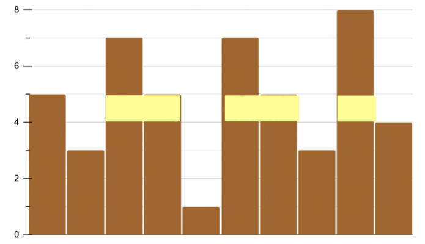

# Task Description
有一個由 $n$ 個木板所組成的柵欄，每個木板的高度為 $h[1], h[2], ..., h[n]$，有 $k$ 張海報要張貼在柵欄上，每張海報的寬度為 $w[1], w[2], \\cdots, w[n]$ 並且高度均為 $1$。

若要張貼海報在高度為 $x$ 的高度，則第 $i$ 張海報需要張貼在一個長度為 $w[i]$ 的連續並且高度都不小於 $x$ 的木板上，且每張海報張貼的高度需要一致、按照順序並不能重疊 (可以相連)。詢問最高可以貼到多高的位置。
# Input Format
第一行有兩個正整數 $n, k$，接下來一行有 $n$ 個正整數代表每個木板的高度，最後一行有 $k$ 個正整數代表每張海報的寬度。

數字範圍

* $1 \\leq n \\leq 200000$
* $1 \\leq k \\leq 5000$
* $1 \\leq h\_i \\leq 10^9$
* $\\sum w\_i \\leq n$

子題配分

* (20%): $1\\leq n \\leq 100, k=1$
* (40%): $k=1$
* (40%): 無額外限制
# Output Format
輸入最大可以張貼的高度。
# Hint
範例 2  
柵欄長相如下圖，三張海報 (寬度為 2, 2, 1) 可以貼在高度為 $5$ 的高度。  

# Sample Input 1
```
5 1
6 3 7 5 1
3
```
# Sample Output 1
```
3

                     ```
# Sample Input 2
```
10 3
5 3 7 5 1 7 5 3 8 4
2 2 1
```
# Sample Output 2
```
5

                     ```

