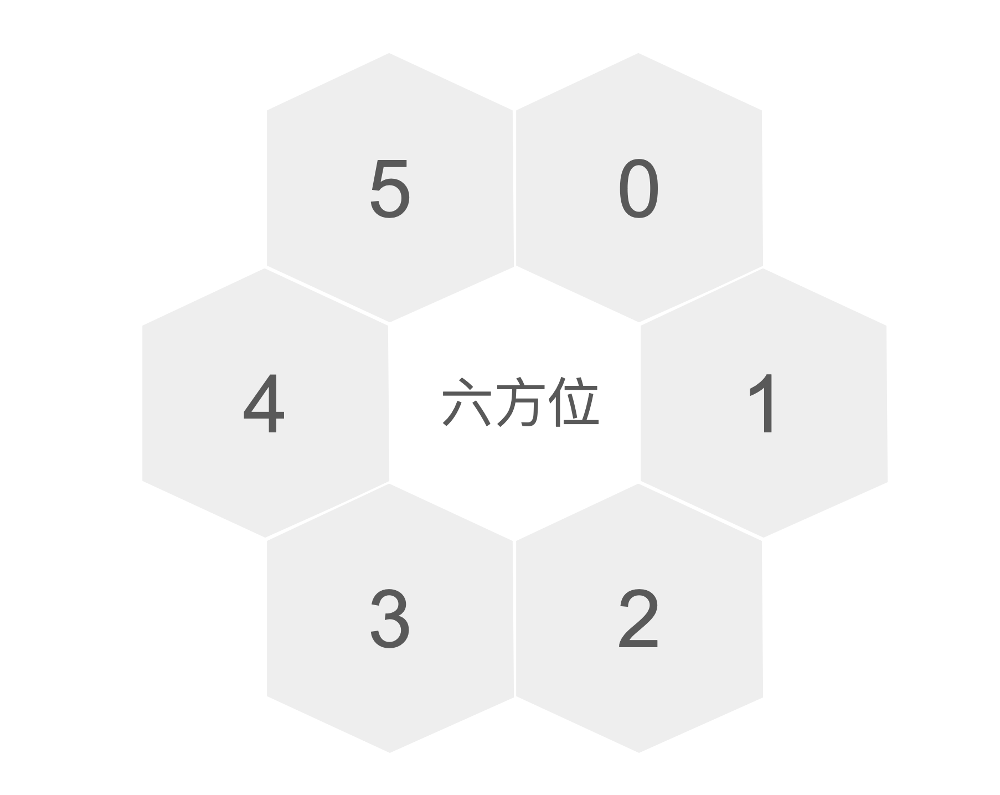
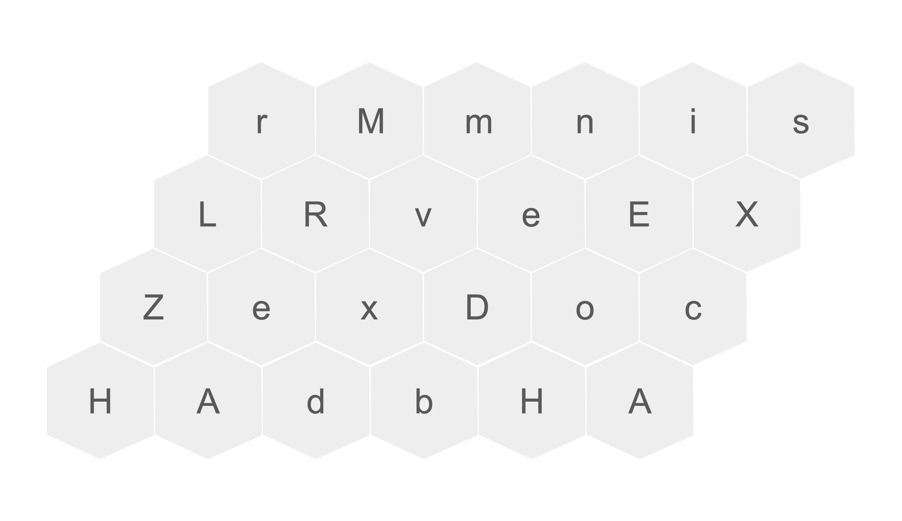

# Task Description
蜜蜂 Bob 在一個大小是 $m \\times n$ 的蜂巢 (見範例說明圖示），並且每個蜂巢格上會有一個代表字母（大小或小寫英文字母）。

Bob 一開始在蜂巢左下角，行走方向定義如圖：0 是往右上; 1 是往右邊; 2 是往右下; 3 是往左下; 4 是往左邊; 5 是往左上。



輸入每步移動的方向，請輸出經過的路徑每格的代表字母，以及經過字元的種類數（大小寫相異），若經過時碰到牆壁該行動會停在原地。
# Input Format
第一行包含三個整數 $m$、$n$、$k$ $(1 \\leq m, n \\leq 20，1 \\leq k \\leq 100)$，表示蜂巢的大小是 $m \\times n$，Bob 的行走路徑有 $k$ 步。

接下來的 $m$ 行，每行包含 $n$ 個字母（大小寫英文字母），代表蜂巢的狀態。

最後一行包含 $k$ 個整數，表示 Bob 的移動路徑方向。

**子題分數：**

* 60%: $m = 2$
* 40%: 無額外限制
# Output Format
輸出一行，包含兩個部分：

* 由 Bob 每步經過的每格代表字母所組成的字串。
* 經過字元的種類數（大小寫視為相異），用一個整數表示。
# Hint
範例輸入 1

 

範例輸入 2


# Sample Input 1
```
2 4 5
TyuI
ABaB
0 1 2 3 0
```
# Sample Output 1
```
Tyaau
4

                     ```
# Sample Input 2
```
4 6 11
rMmnis
LRveEX
ZexDoc
HAdbHA
0 1 5 1 1 0 3 0 0 1 0

```
# Sample Output 2
```
ZeLRvmvmmnn
7

                     ```

