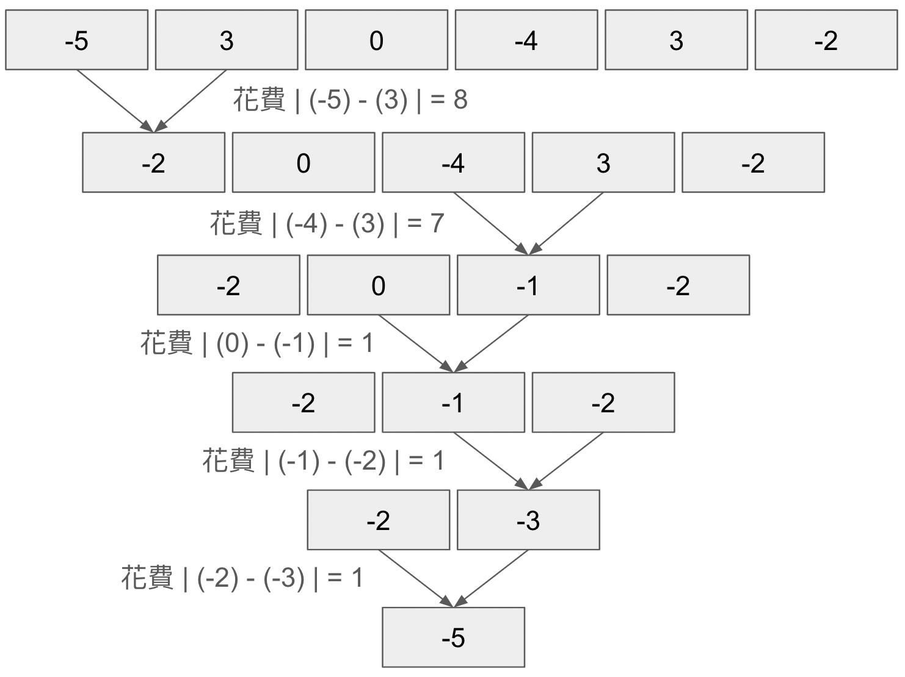

# Task Description
有 $n$ 個數字排成一列，依序是 $a[1], a[2], a[3], \\cdots, a[n]$。

每次可以挑選兩個相鄰的數字 $(u, v)$ 合併，合併會花費 $|u - v|$ 的元，合併起來的數字會變為 $u + v$。

問把 $n$ 個東西合成一個數字的最小花費是多少？


# Input Format
第一行有一個正整數 $n (1 \\leq n \\leq 100)$，表示有多少個東西。

第二行包含 $n$ 個整數 $a[1], a[2], a[3], \\cdots, a[n]$ $(|a[i]| \\leq 1000)$，相鄰兩個數字之間用空格隔開。

**子題分數：**

* 30%: $n \\leq 13$
* 70%: 無額外限制
# Output Format
輸出最小花費。
# Hint
範例 1 說明：

1. 輸入陣列 `[3, -1, 2, 5]`
2. 合併 1 和 2：`[2, 2, 5]`，花費為 `abs(3 - (-1)) = 4`
3. 合併 1 和 2：`[4, 5]`，花費為 `abs(2 - 2) = 0`
4. 合併 1 和 2：`[9]`，花費為 `abs(4 - 5) = 1`

總花費為 `4 + 0 + 1 = 5`，因此輸出為 `5`。

範例 2 說明請見題目敘述的圖
# Sample Input 1
```
4
3 -1 2 5
```
# Sample Output 1
```
5

                     ```
# Sample Input 2
```
6
-5 3 0 -4 3 -2
```
# Sample Output 2
```
18

                     ```
# Sample Input 3
```
7
-1 -6 6 -8 7 0 -9
```
# Sample Output 3
```
36

                     ```

