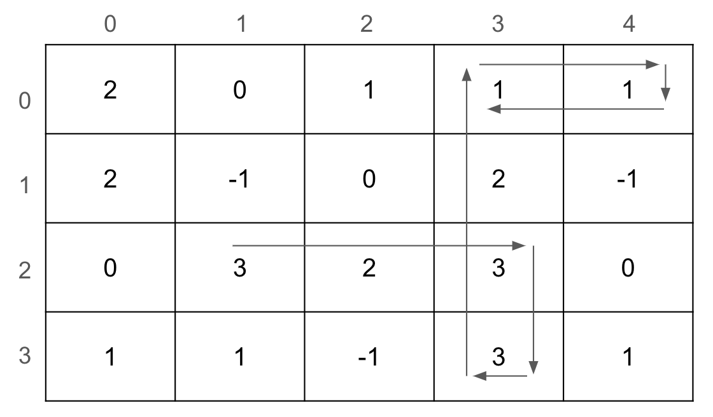

# Task Description
有一個 $M \\times N$ 的地圖，每一格的數字紀錄著寶石的數量，如果數字是 -1 代表牆壁。  
有一位機器人一開始位於 $(r, c)$ 的位置上且方向朝右邊，他遵循著以下規則行走。  
1. 若機器人位於的格字內寶石數量為 $0$，則機器人程式終止。  
2. 機器人維護著一個分數 score，將 score 加上當前格的寶石數量，並且撿起一顆寶石。  
3. 若 score 是 $k$ 的倍數，則向右轉 90 度。  
4. 若機器人面向的格子是牆壁或是超出邊界，則繼續向右轉 90 度直到面向的格子非牆壁或非超出邊界，並回到第 1 步。



例如機器人一開始在座標 $(2, 1)$ 且 $k = 2$，向右走兩步之後分數為 $3 + 2 + 3 = 8$，由於 $8$ 是 $2 (k = 2)$ 的倍數所以向右轉 $90$ 度。接下來往下走一步分數變為 $11$，需要向右轉 $2$ 次 $90$ 度才不會面向牆壁或是邊界外的格子。

接下來向前走一步走到座標 $(2, 3)$，由於先前已經拿走一顆寶石，該位置的寶石數量變為 $2$，因此分數變為 $13$，再繼續往上走兩步到 $(0, 3)$ 處分數為 $16$，由於 $16$ 為 $2 (k = 2)$ 的倍數所以向右轉 $90$ 度。

向前走一格到 $(0, 4)$ 後需要向右轉兩次 $90$ 度，回到 $(0, 3)$ 後由於寶石數量為 $0$，機器人停止。過程中機器人總共撿了 $8$ 顆寶石。
# Input Format
第一行有 $5$ 個正整數 $M, N, k, r, c$

$1 \\le M \\le 100$

$2 \\le N \\le 100$

$1 \\le k \\le 20$

$0 \\le r \< m$

$0 \\le c \< n$

保證機器人初始位置不是牆壁。接下來有 $M$ 行，每一行有 $N$ 的數字，代表地圖的資訊。

(60%) M = 1  
(40%) 無限制
# Output Format
輸出機器人會蒐集幾個寶石。
# Hint
感謝 王洋森 提供範例測資與題目資訊
# Sample Input 1
```
1 7 3 0 4
1 -1 2 1 2 1 0
```
# Sample Output 1
```
5

                     ```
# Sample Input 2
```
4 5 4 2 1
2 0 1 1 1
2 -1 0 2 -1 
0 3 2 3 0
1 1 -1 3 1
```
# Sample Output 2
```
8

                     ```

